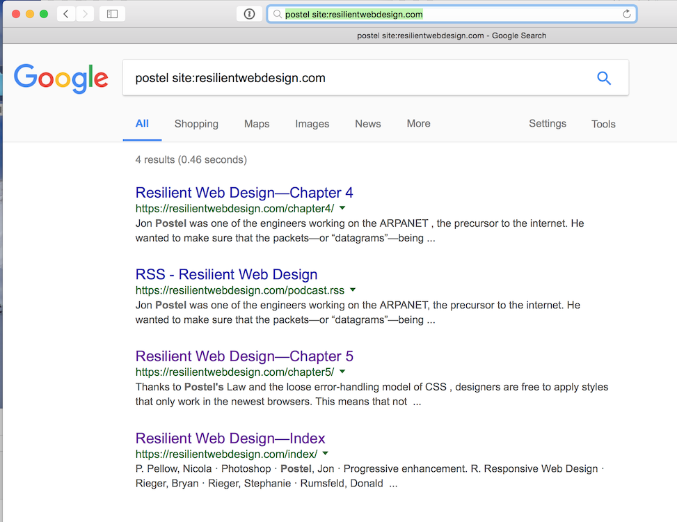
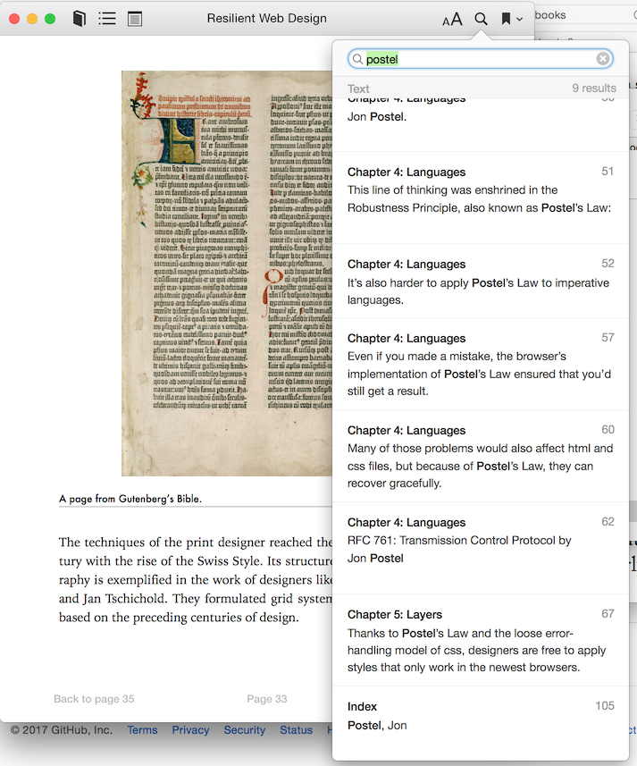

# Reading a book on the web

Is a book a web site? A progressive web app? Something more? Does the web need new features to truly support books? What can we learn from experiments with web books, from the experience of EPUB, from the history of browsers?

## 1. A Web Book

It's so much easier to talk about something when you have something to talk about.

When talking about web books, I like to look at Jeremy Keith's [Resilient Web Design](https://resilientwebdesign.com/) (henceforth "RWD"). I think of this as the state of the art for books on the web today. Let's start reading. 

## 2. Ideas of Order

What's important about books fits in a single sentence—chapter two comes after chapter one, but they're both part of the book.

With RWD, we have a landing page with a table of contents. We can click on "Introduction," which comes next. Or there's the same link from the "begin reading now" text. 

But, if you're using Opera 12, you can read the entire book just by clicking the space bar. That's because of the magic of rel=next, HTML’s way of defining a sequence of documents. Sadly, current browsers don't seem to do much with the [sequential link types](https://html.spec.whatwg.org/#sequential-link-types).

## 3. I'll Finish It Tomorrow

I read half of chapter three, and then had to do something else with my browser. 

If I can get back to the URL with the forward or back button on my browser, it will remember that I'm halfway down the page because of the back/forward cache. If I have to reload the URL, or if I quit the browser, I'm out of luck.

My ebook reader even remembers where I was after I switched from my phone to my tablet.

## 4. This Font Hurts My Eyes.

With regular browser pages, if you want to change the font, you have to figure out how user stylesheets work, and write some CSS. It's not so simple that a C-level executive can do it.

If I switch to a browser reading mode, the situation is better. I might be able to choose a serif or sans-serif font. I can change the background. I can easily make the text bigger. But why is it now telling me how long this will take to read? What happened to the design? [Why did my H2 disappear](link needed)?

All these features are routine in ebook readers. 

## 5. Reading on the Train.

I'm reading RWP on the train, and go into a tunnel (let's pretend we're in Europe, where there are trains). I can keep reading because the book works offline, thanks to service workers and appcache. Good job.

## 6. Mine.

I want to save a copy of the book. I suppose I could go through each HTML document in turn and save via the browser.

## 7.  Search

What if I want to find something in the book? I hit command-F in my browser, and I can search the current document, but not the book. 

I have to go to google and type a search term followed by site:resilientwebdesign.com.

It's much easier in iBooks:

Almost uniquely, for something on the web, RWD does have an index. But if I find "Postel" in the index, it only links to the chapter 4 discussion, not the mention in chapter 5.

## 8. Highlights.

Highlights, bookmarks, annotations--the web is working on this. 

## Epilogue: What Have We learned?

1. We have a finite sequence of web resources,

2. With user requirements around 

search, 
personalization, 
annotation,
saving state,
and robust offline support.

3. That's it!

